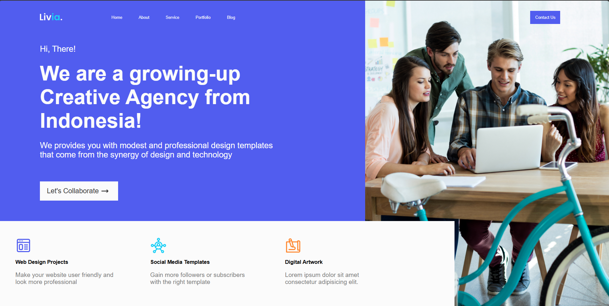
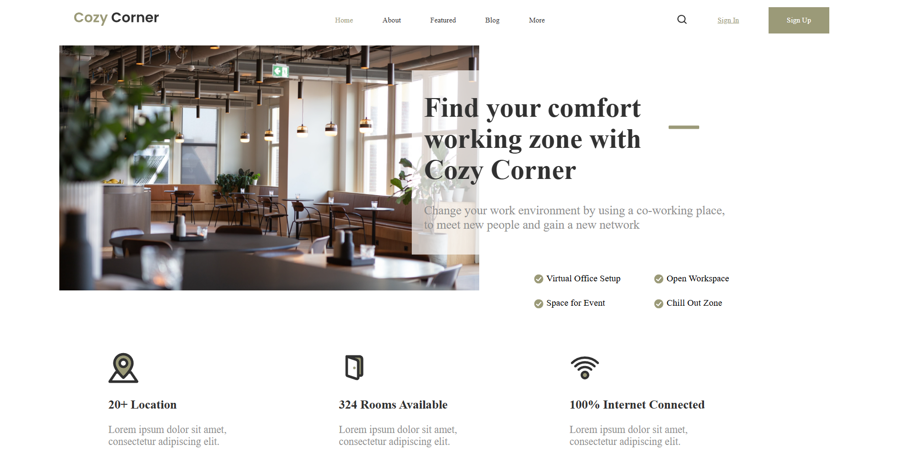

# 🚀 Frontend Basics Projects

This repository contains a collection of **basic web development projects** built with **HTML and CSS**.  
Each project was created to practice structure, layout, and design fundamentals while improving coding discipline and workflow with Git and GitHub.

---

## 🧠 About

These projects represent my first steps into **front-end development**, focusing on static web pages and responsive design principles.  
Every project explores different design concepts — from business landing pages to e-commerce layouts — helping build a solid foundation before moving on to JavaScript and backend technologies.

---

## 🧩 Technologies Used

- **HTML5** → Semantic structure and accessibility  
- **CSS3** → Styling, layout, and design  
- **Git & GitHub** → Version control and project hosting  

---

## 📚 Projects Overview

| # | Project | Description | Preview |
|:-:|:--------|:-------------|:---------|
| 1 | **Header Business Agency** | A modern landing page for a business agency with services overview and hero section. |  |
| 2 | **Creative Agency** | A stylish creative agency homepage with service cards and call-to-action area. |  |
| 3 | **Coworking Space** | A landing page for a coworking service showcasing features and locations. |  |
| 4 | **NFT Marketplace** | A digital art and NFT marketplace concept with featured artwork gallery. |  |
| 5 | **Grocery Store** | A clean grocery e-commerce landing page with product categories and search. |  |

---

## 💡 What I Learned

- Creating semantic and organized HTML structures  
- Styling reusable components with CSS  
- Managing multiple projects within one repository  
- Writing professional README files in English  
- Using Git and GitHub for version control and commits  

---

## 📈 Next Steps

- Build **individual repositories** for larger projects  
- Learn **JavaScript** for interactivity and DOM manipulation  
- Begin working with **responsive design** for all screen sizes  
- Move toward **Full Stack Development**

---

## 📬 Contact

Created by **[RobertoNDH](https://github.com/RobertoNDH)**  
📧 robertonauzet@gmail.com  

---

⭐ *If you like this collection, don’t forget to give it a star on GitHub!* ⭐