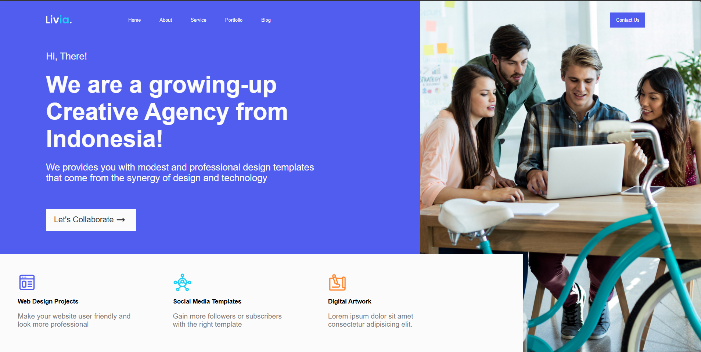

# 🎨 Creative Agency

A modern and elegant **landing page** for a creative design agency built with **HTML and CSS**.  
This project focuses on presenting a professional digital agency called **Livia**, with a clean navigation bar, hero section, and services overview.

---

## 🧠 About the Project

This project showcases a fictional creative agency from Indonesia that provides design and digital services.  
It was built to practice layout composition, spacing, typography, and the balance between content and visual hierarchy.

---

## 🧩 Features

- Modern and minimal layout  
- Hero section with strong call-to-action  
- Professional navigation menu  
- Service cards with icons and descriptions  
- Simple and clean visual hierarchy  

---

## 🛠️ Built With

- **HTML5** – Semantic and accessible structure  
- **CSS3** – Styling and layout implementation  
P
---

## 💡 What I Learned

- Structuring a creative landing page with semantic HTML  
- Organizing layout and spacing with CSS  
- Working with SVG icons and assets  
- Creating consistent design across multiple sections  

---

## 📸 Project Preview

---

## 📬 Contact

Created by **[RobertoNDH](https://github.com/RobertoNDH)**  
📧 robertonauzet@gmail.com  

---

⭐ *If you like this project, feel free to give it a star on GitHub!* ⭐

