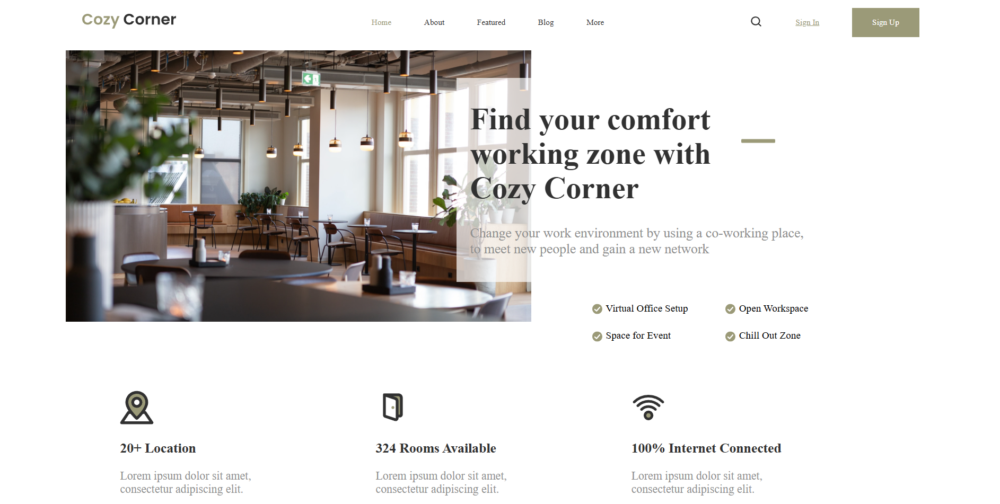

# 🏢 Coworking Space

A clean and modern **landing page** for a coworking business built with **HTML and CSS**.  
The project presents **Cozy Corner**, a comfortable workspace provider designed to help professionals find their ideal work environment.

---

## 🧠 About the Project

This project focuses on building a promotional website for a coworking company.  
It highlights the services, workspace benefits, and statistics to attract freelancers, startups, and digital nomads.  
The goal was to practice layout composition, section structuring, and responsive organization using only HTML and CSS.

---

## 🧩 Features

- Fully structured landing page layout  
- Navigation bar with logo and links  
- Hero section with main image and call-to-action  
- Service highlights with icons  
- Information cards with statistics  
- Organized and semantic HTML  

---

## 🛠️ Built With

- **HTML5** – Semantic structure  
- **CSS3** – Styling and responsive layout  
- **Google Fonts (Playfair)** – Elegant typography integration  

---

## 💡 What I Learned

- Structuring a complete landing page for a service-oriented website  
- Using icons and images to support the message visually  
- Applying consistent spacing and layout rules  
- Integrating custom Google Fonts for better visual identity  

---

## 📸 Project Preview

---

## 📬 Contact

Created by **[RobertoNDH](https://github.com/RobertoNDH)**  
📧 robertonauzet@gmail.com  

---

⭐ *If you like this project, feel free to give it a star on GitHub!* ⭐

