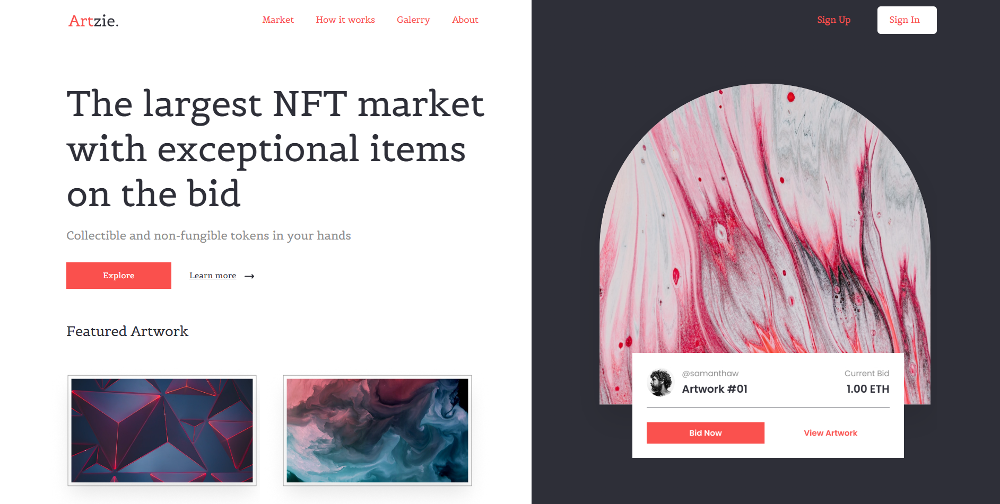

# 💎 NFT Marketplace

A sleek and modern **landing page** for an NFT marketplace built with **HTML and CSS**.  
This project presents **Artzie**, a fictional NFT platform designed to showcase digital artwork and connect creators with collectors.

---

## 🧠 About the Project

The goal of this project was to design a clean and engaging landing page for an NFT marketplace.  
It highlights the main hero section with a call-to-action, navigation links, and a featured artwork gallery to display digital collectibles.

---

## 🧩 Features

- Responsive landing page layout  
- Hero section with strong headline and buttons  
- Navigation bar with clear menu items  
- Featured artwork gallery section  
- Semantic and well-organized HTML structure  
- Elegant typography using **Belgrano** from Google Fonts  

---

## 🛠️ Built With

- **HTML5** – Semantic markup  
- **CSS3** – Styling and layout design  
- **Google Fonts (Belgrano)** – Clean and artistic typography  

---

## 💡 What I Learned

- Building a complete landing page for a digital product concept  
- Structuring HTML sections for better content flow  
- Creating visual hierarchy with typography and spacing  
- Designing a gallery layout for images using CSS  

---

## 📸 Project Preview

---

## 📬 Contact

Created by **[RobertoNDH](https://github.com/RobertoNDH)**  
📧 robertonauzet@gmail.com  

---

⭐ *If you like this project, feel free to give it a star on GitHub!* ⭐