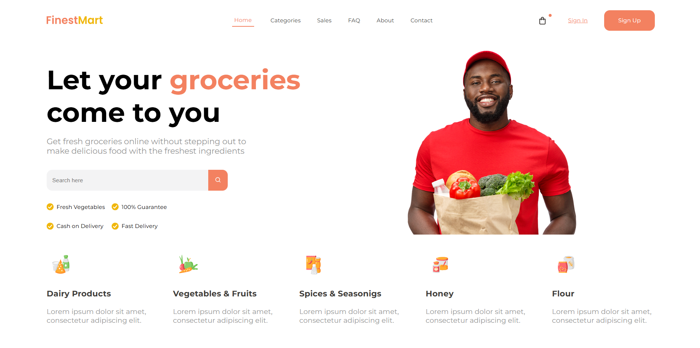

# 🛒 Grocery Store

A clean and modern **landing page** for an online grocery store built with **HTML and CSS**.  
This project presents **FinestMart**, a fictional e-commerce grocery platform that allows users to order fresh food and daily essentials online.

---

## 🧠 About the Project

The goal of this project was to create a professional grocery store landing page showcasing products, features, and an intuitive design.  
It includes a hero section with search functionality, selling points, and product categories — all designed to simulate a real e-commerce homepage.

---

## 🧩 Features

- Fully structured and responsive landing page  
- Navigation bar with logo, links, and shopping bag icon  
- Hero section with main headline and search bar  
- List of selling points and benefits  
- Product categories with icons and descriptions  
- Semantic and well-organized HTML layout  

---

## 🛠️ Built With

- **HTML5** – Semantic and accessible structure  
- **CSS3** – Styling and layout implementation  
- **Google Fonts (Montserrat)** – Clean and modern typography  

---

## 💡 What I Learned

- Building a complete e-commerce style landing page  
- Organizing multiple content sections with semantic HTML  
- Using consistent typography and color hierarchy  
- Implementing icons and images for category visualization  
- Enhancing layout composition with spacing and structure  

---

## 📸 Project Preview

---

## 📬 Contact

Created by **[RobertoNDH](https://github.com/RobertoNDH)**  
📧 robertonauzet@gmail.com  

---

⭐ *If you like this project, feel free to give it a star on GitHub!* ⭐